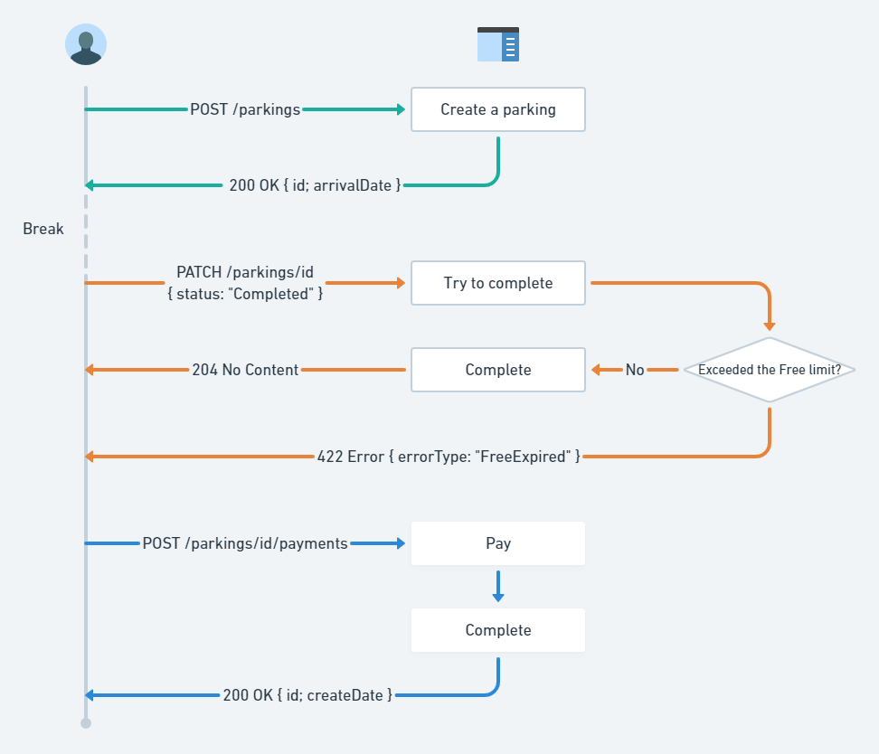

# CarParking
A "real" web app written on F#.

## Description
The goal is to demonstrate an interaction between F#, SQL database and frontend part.

## Solution Structure
<ul>
<li><b>CarParking.Core</b></li>
A pure layer containing the domain types and business logic.
<li><b>CarParking.DataLayer</b></li>
Commands/queries over the SQL Database, using Dapper.
<li><b>CarParking.Workflow</b></li>
A layer describes the full business workflow <i>compositing</i> impure and pure things rather than <i>mixing</i>. The idea is based on Dependency Rejection approach.
<li><b>CarParking.Error</b></li>
Application errors.
<li><b>CarParking.WebApi</b></li>
A Giraffe web server. The api handlers calls the CarParking.Workflow directly.
<li><b>CarParking.WebUI</b></li>
A web server (Razor pages) serving an angular app.
<li><b>CarParking.Workflow.IntegrationTests</b></li>
Property-based integration testing
</ul>

## How it works


## Requirements
- .NET Core >= 3.1
- Docker >= 19
- (Optional) Paket: You can get all dependencies using `dotnet restore` without having Paket, since there is the `.paket/Paket.Restore.targets` file
- (Optional) Node >= 12.14, npm >= 6.13: Required if there is a desire to build UI

## Getting Started
1. Build the database
```cmd
docker-compose build
docker-compose up database
```
2. Build the Web api
```cmd
cd CarParking.WebApi
dotnet run ASPNETCORE_ENVIRONMENT=Development
```
3. Web api is ready for work. That's enough to be able to use Postman or other client to play with the api. `postman_calls.json` - a collection of api calls intended to be imported to Postman.

## Build UI
4. Build the Angular app
```cmd
cd CarParking.WebUI\frontend
npm i
npm run build
```
5. Run the Web server
```cmd
cd CarParking.WebUI
dotnet run ASPNETCORE_ENVIRONMENT=Development
```
6. Open https://localhost:5051/
7. Enjoy

## Run Integration Tests
```cmd
docker-compose up database_tests
dotnet test -v n
```

# Inspired By
## Articles
<ul>
<li>
<a href="https://fsharpforfunandprofit.com/">F# for fun and profit (Scott Wlaschin)</a></li>
<li>
<a href="https://blog.ploeh.dk/2017/01/27/from-dependency-injection-to-dependency-rejection/">From dependency injection to dependency rejection (Mark Seemann)</a></li>
</ul>

## Video
<ul>
<li>
<a href="https://www.youtube.com/watch?v=9zpG_hJsrL8">Dependency Rejection and TDD without Mocks. Антон Молдован</a></li>
<li>
<a href="https://www.youtube.com/watch?v=xG5qP5AWQws">Mark Seemann — From dependency injection to dependency rejection</a></li>
</ul>


